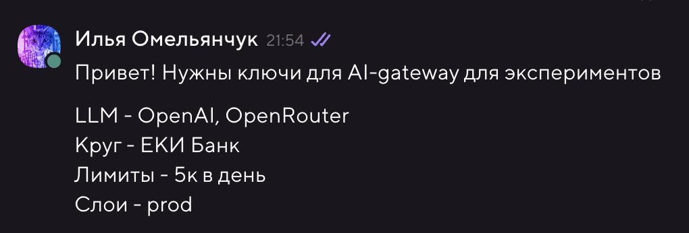

# Вайбкод для дизайнеров: собираем кликабельный прототип на React из макета в Figma

Раньше, чтобы показать продукт в деле, нужен был разработчик, две недели и чашечка терпения. Теперь есть AI-агенты — и достаточно одного дизайнера с хорошим промптом.

Этот гайд — для тех, кто умеет делать красиво в Figma, но пишет код примерно с той же уверенностью, с которой разработчики рисуют в Illustrator. И это нормально — именно для вас всё это и придумано.

**Что получим в итоге:** живой кликабельный прототип в браузере, который можно показать команде, стейкхолдерам или пустить на пользовательское тестирование.

---

## Содержание

1. [Получение доступа к корпоративному AI](#1-получение-доступа-к-корпоративному-ai)
2. [Что нужно установить](#2-что-нужно-установить)
3. [Подключение AI-агента](#3-подключение-ai-агента)
4. [Связка Figma ↔ Агент через MCP](#4-связка-figma--агент-через-mcp)
5. [Собираем прототип шаг за шагом](#5-собираем-прототип-шаг-за-шагом)
6. [Публикуем прототип — делимся ссылкой](#6-публикуем-прототип--делимся-ссылкой)
7. [Дизайн-система в файле: зачем и как](#7-дизайн-система-в-файле-зачем-и-как)
8. [Готовые промпты — бери и используй](#8-готовые-промпты)
9. [Что-то пошло не так?](#9-что-то-пошло-не-так)

---

## Словарик: что за слова такие

Если встречаете незнакомый термин — смотрите сюда.

| Слово | Что это на самом деле |
|-------|-----------------------|
| **Терминал** | Текстовое окно, в которое вводят команды. Как командная строка для компьютера. Мы будем использовать терминал прямо внутри редактора кода — ничего страшного |
| **Редактор кода / IDE** | Программа для написания кода. Как Figma, только для кода. Мы будем использовать VS Code или Cursor |
| **API-ключ** | Пароль, который даёт агенту право пользоваться AI-моделью |
| **Base URL** | Адрес сервера с AI-моделью. Выглядит как ссылка |
| **MCP** | Протокол, через который агент «видит» ваш дизайн в Figma — слои, размеры, тексты |
| **React** | Популярная технология для создания интерфейсов. Агент будет писать код на ней за вас |
| **npm** | Менеджер пакетов — устанавливает нужные библиотеки командой в терминале |
| **Git / Commit** | Система сохранения версий. Как «История версий» в Figma |

---

## 1. Получение доступа к AI Gateway

Агенту нужно чем-то думать. Для этого — доступ к AI-модели через корпоративный AI Gateway.

### Как получить API-ключ

1. Откройте канал **@llm_support** в Коннекте: [connect.tochka.com/tochka/channels/llm-support/](https://connect.tochka.com/tochka/channels/llm-support/)
2. Напишите сообщение примерно такого формата:

```
Привет! Нужны ключи для AI-gateway для экспериментов
LLM - OpenAI, OpenRouter
Круг - ЕКИ Банк
Лимиты - 5к в день
Слои - prod
```

3. Дежурный уточнит детали, если что-то не ясно
4. Ключ придёт вам **в личку в Коннекте** через бота



> ⚠️ **Важно:** API-ключ — это как пароль. Никому его не показывайте и не отправляйте в общие чаты.

### Что вы получите

После одобрения у вас будет две вещи, которые понадобятся для настройки агента:

- **Base URL** — адрес AI Gateway: `https://ai-gateway-api.query.consul-prod/api/v1/compatible/openai`
- **API Key** — ваш персональный ключ: `sk-xxxx...`

Запишите обе строки в безопасное место — скоро понадобятся.

> 🔴 **ВАЖНО: не отправляйте в агент конфиденциальные данные!** AI-агент передаёт всё, что вы пишете, на сервер с моделью. Никогда не вставляйте в чат агента: пароли, токены доступа, персональные данные клиентов, внутренние секреты и ключи. Агент — это инструмент для прототипирования, а не хранилище секретов.

### Какую модель выбрать

Не все модели одинаково хороши для написания кода. Вот что рекомендуем:

| Модель | Для чего подходит | Рекомендация |
|--------|-------------------|--------------|
| **Claude Opus 4.6** | Лучший выбор для кодинга — отлично понимает контекст, пишет чистый код, хорошо работает с React | 👈 Рекомендуем |
| **Gemini 3.1 Pro** | Отличная альтернатива — быстрая, хорошо справляется с большими проектами | 👈 Рекомендуем |
| **GPT-4o** | Хороший универсал, но для кода чуть слабее Opus и Gemini | Подойдёт |
| **GPT-4o-mini** | Быстрая, но менее точная — для простых правок | Для мелочей |

> 💡 **Совет:** начните с **Claude Opus 4.6** — он лучше всех понимает дизайн-системы и пишет аккуратный React-код. Если нужна скорость — переключитесь на **Gemini 3.1 Pro**.

> 💡 **Технический момент, который не обязательно понимать:** AI Gateway притворяется OpenAI API. Поэтому в настройках агента мы выбираем провайдера «OpenAI Compatible» и вставляем туда наш корпоративный адрес. Агент даже не заметит разницы.

---

## 2. Что нужно установить

Два инструмента — и можно работать.

### VS Code — редактор кода

Это программа, в которой живёт наш проект. Выглядит немного как текстовый редактор, но умеет намного больше.

1. Зайдите на [code.visualstudio.com](https://code.visualstudio.com)
2. Нажмите **Download** — скачается установщик под вашу систему
3. Установите как обычную программу
4. Запустите

> **Альтернатива:** [Cursor](https://cursor.com) — это тот же VS Code, но с встроенным AI-ассистентом. Если планируете пользоваться им — просто скачайте Cursor вместо VS Code. Всё остальное в гайде работает одинаково.

### Node.js — движок для запуска проектов

Без этого прототип не запустится в браузере.

1. Зайдите на [nodejs.org](https://nodejs.org)
2. Скачайте версию **LTS** — это стабильная, рекомендованная версия
3. Установите (нажимайте «Далее» на каждом шаге)

**Проверьте, что всё работает:**

1. Откройте терминал:
   - **Mac:** `Cmd + Пробел` → напечатайте «Terminal» → Enter
   - **Windows:** `Win + R` → напечатайте `cmd` → Enter
2. Введите `node -v` и нажмите Enter
3. Должна появиться версия, например `v20.11.0` — это значит, всё в порядке ✅

---

## 3. Подключение AI-агента

Агент — это ваш напарник-разработчик. Вы пишете ему на обычном языке, что хотите, он создаёт и редактирует файлы, запускает команды. Разница с реальным разработчиком: агент не уходит на обед и не спрашивает «а зачем нам это вообще нужно».

У нас три варианта:

| | Cline | Continue | Cursor |
|-|-------|----------|--------|
| **Тип** | Расширение VS Code | Расширение VS Code | Отдельная программа |
| **Цена** | Бесплатно | Бесплатно | $20/мес (есть бесплатный лимит) |
| **Корпоративный API** | ✅ | ✅ | ✅ |
| **Рекомендуем** | 👈 Да | Да | Если готовы платить |

---

### Вариант А: Cline (рекомендуем)

#### Шаг 1. Установка

1. Откройте VS Code
2. Нажмите иконку расширений в левой панели — это четыре квадратика, один из которых немного отлетел (`Cmd+Shift+X`)
3. В поиске напечатайте **Cline**
4. Нажмите **Install**

#### Шаг 2. Подключение корпоративной модели

1. В левой панели VS Code появилась иконка Cline (похожа на робота) — нажмите на неё
2. Нажмите на **⚙ шестерёнку** вверху панели Cline
3. В поле **API Provider** выберите `OpenAI Compatible`
4. Заполните три поля:
   - **Base URL** → `https://ai-gateway-api.query.consul-prod/api/v1/compatible/openai`
   - **API Key** → ваш ключ из шага 1
   - **Model ID** → название модели, например `claude-opus-4.6` или `gemini-3.1-pro`
5. Нажмите **Done**

Всё. Теперь можно писать Cline'у в чат — и он будет делать код. 🎉

---

### Вариант Б: Continue

#### Шаг 1. Установка

`Cmd+Shift+X` → поиск **Continue** → **Install**

#### Шаг 2. Подключение корпоративной модели

1. Нажмите `Cmd+Shift+P` — откроется строка поиска команд вверху окна (это очень полезная штука, запомните её)
2. Напечатайте `Continue: Open config.json` и нажмите Enter
3. Откроется файл настроек. Найдите строчку `"models": [` и добавьте после открывающей скобки `[`:

```json
{
  "title": "Corporate LLM",
  "provider": "openai",
  "model": "название-вашей-модели",
  "apiKey": "ВАШ_API_КЛЮЧ",
  "apiBase": "https://ai-gateway-api.query.consul-prod/api/v1/compatible/openai"
},
```

4. Сохраните файл (`Cmd+S`)
5. Внизу чата Continue выберите «Corporate LLM» из списка моделей

---

### Вариант В: Cursor

1. Скачайте и установите [Cursor](https://cursor.com)
2. Откройте **Settings** (иконка шестерёнки внизу слева) → **Models**
3. Прокрутите вниз до раздела **OpenAI API Key**
4. Вставьте ваш API-ключ
5. В поле **Override OpenAI Base URL** вставьте ваш корпоративный URL
6. В разделе **Model Names** введите название модели и нажмите **+**
7. Выберите добавленную модель в чате агента

---

## 4. Связка Figma ↔ Агент через MCP

Агент умный — но он не видит ваш экран. Без специальной связки вы бы объясняли ему на словах: «ну там заголовок, под ним картинка, кнопка синяя...». Это долго и неточно.

**MCP (Model Context Protocol)** — это протокол, который позволяет агенту открыть ваш Figma-файл и прочитать его изнутри: какие слои, какие размеры, какие тексты, как они расположены. Как если бы агент сам открыл Figma и посмотрел на макет.

MCP встроен прямо в **Figma Desktop App** через Dev Mode — ничего дополнительно устанавливать не нужно.

### Шаг 1. Включите Dev Mode MCP в Figma

1. Скачайте и откройте **Figma Desktop App** — [figma.com/downloads](https://www.figma.com/downloads/) (браузерная версия не подойдёт!)
2. Откройте любой файл в Figma
3. Переключитесь в **Dev Mode** — кнопка в правом верхнем углу (или шорткат `Shift+D`)
4. Figma автоматически запустит локальный MCP-сервер на вашем компьютере — агент сможет к нему подключиться

### Шаг 2. Получите Figma Access Token

В Figma есть понятие «токен» — это не только дизайн-токен, но ещё и ключ доступа. Нам нужен Personal Access Token.

1. Откройте [figma.com](https://www.figma.com) в браузере
2. Нажмите на аватарку → **Settings**
3. Прокрутите до раздела **Personal Access Tokens**
4. Нажмите **Generate new token**, дайте имя (например, `MCP Agent`)
5. **Сразу скопируйте токен** — после закрытия окна он больше не покажется

### Шаг 3. Создайте папку проекта

1. Откройте Finder (Mac) или Проводник (Windows)
2. Зайдите в «Документы» или любое удобное место
3. Создайте новую папку. Назовите её латиницей, без пробелов: например, `onboarding-prototype`

### Шаг 4. Откройте папку в VS Code

- **Способ 1:** VS Code → меню **File** → **Open Folder...** → выберите папку
- **Способ 2 (удобнее):** Правый клик на папке в Finder → **Открыть с помощью** → VS Code

### Шаг 5. Настройте MCP в агенте

Попросите агента создать файл конфигурации за вас. Напишите ему в чат:

**Для Cline — напишите:**
```
Создай файл .cline/mcp_settings.json со следующим содержимым:
{
  "mcpServers": {
    "figma-devmode": {
      "url": "http://127.0.0.1:3845/sse"
    }
  }
}
```

**Для Cursor — напишите:**
```
Создай файл .cursor/mcp.json со следующим содержимым:
{
  "mcpServers": {
    "figma-devmode": {
      "url": "http://127.0.0.1:3845/sse"
    }
  }
}
```

> 💡 `127.0.0.1:3845` — это Figma Desktop, запущенная на вашем же компьютере. Никакого внешнего сервера не нужно.

---

## 5. Собираем прототип шаг за шагом

Вот как выглядит полный флоу:

```
Макет в Figma  →  Агент читает его через MCP  →  Агент пишет код  →  Прототип в браузере
```

### Перед стартом убедитесь:

- ✅ VS Code открыт с папкой проекта
- ✅ Агент подключён и отвечает
- ✅ Figma Desktop открыта с вашим файлом
- ✅ Файл конфигурации MCP создан

### Шаг 1. Запускаем проект

Напишите агенту в чат:

```
Создай новый React-проект с Vite.
Добавь React Router для навигации между страницами.
Структура папок: src/pages, src/components, src/styles.
```

Агент сделает всё сам. Периодически он будет спрашивать разрешения что-то сделать — нажимайте **Approve**. Это нормально, он просто вежливый.

### Шаг 2. Отдаём дизайн-систему

Если вы сделали файл с правилами дизайн-системы (см. [раздел 6](#6-дизайн-система-в-файле-зачем-и-как)) — сначала передайте его агенту:

```
Прочитай файл design-system.md — это наша дизайн-система.
Создай CSS-переменные на основе этих токенов.
```

### Шаг 3. Собираем первый экран

1. В Figma Desktop **кликните на нужный фрейм** — он выделится
2. Перейдите в VS Code и напишите:

```
Посмотри на выделенный фрейм в Figma через MCP.
Это экран «Главная страница».
Реализуй его как React-компонент.
Используй CSS-переменные из дизайн-системы. Тексты — точно из макета.
```

3. Подождите пока агент создаст файлы
4. Агент сам запустит проект командой `npm run dev` — в терминале появится ссылка вида `http://localhost:5173`. Откройте её в браузере — это ваш прототип

### Шаг 4. Правьте, пока не понравится

Смотрите в браузере, сравнивайте с Figma, пишите агенту:

```
Отступ между заголовком и подзаголовком — 16px, а не 24px.
Кнопка должна быть на всю ширину.
Цвет иконки — Text Secondary из дизайн-системы.
```

Это нормальный процесс. 5–10 правок на экран — не много.

### Шаг 5. Добавляем остальные экраны

Повторите шаги 3–4 для каждого экрана. Потом свяжите их навигацией:

```
Добавь навигацию:
- кнопка «Продолжить» на экране Onboarding 1 → переход на Onboarding 2
- кнопка «Назад» → возврат
- нижний таб-бар: Главная, Поиск, Профиль (активный подсвечивается цветом Primary)
```

### Правила хорошего вайбкода

| | |
|-|-|
| 🎯 **Один экран за раз** | Не просите «сделай всё приложение» — хорошо не сделает |
| 👀 **Проверяйте сразу** | Смотрите в браузере после каждого экрана |
| 📏 **Конкретные числа** | «16px» лучше, чем «чуть меньше» |
| 🔄 **Не бойтесь итераций** | Вайбкод — это диалог, а не одна команда |
| 💾 **Сохраняйте прогресс** | Периодически просите: «Сделай git commit» |

---

## 6. Публикуем прототип — делимся ссылкой

Прототип готов и работает у вас на компьютере — теперь нужно поделиться им. Есть два способа: быстрый и правильный.

### Вариант А: Netlify Drop — проще не бывает

Это буквально «перетащи папку — получи ссылку». Ничего регистрировать не обязательно.

1. Попросите агента собрать готовую статическую версию проекта:

```
Собери проект командой npm run build.
После сборки в папке проекта появится папка dist/ — покажи где она.
```

2. Откройте [app.netlify.com/drop](https://app.netlify.com/drop)
3. Перетащите папку `dist/` прямо в окно браузера
4. Через несколько секунд получите ссылку вида `https://random-name-123.netlify.app`

> Ссылка работает сразу. Зарегистрируйтесь на Netlify, чтобы потом переименовать адрес или обновить версию.

---

### Вариант Б: GitHub Pages — красиво и бесплатно навсегда

Чуть сложнее, зато прототип будет по адресу `https://ваш-ник.github.io/название-проекта`.

#### Шаг 1. Зарегистрируйтесь на GitHub

Если аккаунта нет — зайдите на [github.com](https://github.com) и создайте (это бесплатно).

#### Шаг 2. Сделайте репозиторий

1. Нажмите **+** → **New repository**
2. Дайте имя (например, `onboarding-prototype`), выберите **Public**
3. Нажмите **Create repository**
4. Скопируйте адрес репозитория — он нужен для следующего шага

#### Шаг 3. Залейте проект

Напишите агенту:

```
Настрой и задеплой проект на GitHub Pages.
Адрес репозитория: [вставьте ссылку, например https://github.com/ваш-ник/onboarding-prototype]
Нужно:
1. Установить пакет gh-pages
2. Добавить в vite.config.ts параметр base с именем репозитория
3. Добавить в package.json скрипт deploy
4. Добавить remote origin и сделать первый push
5. Запустить npm run deploy
```

Агент сделает всё сам и даст финальную ссылку.

> После деплоя GitHub Pages включается не мгновенно — подождите 2–3 минуты, потом откройте ссылку.

---

## 7. Дизайн-система в файле: зачем и как

Агент через MCP видит структуру Figma: элементы, размеры, положение. Но ваши токены — нет. Он не знает, что `Primary` — это `#6C5CE7`, а spacing-md — это `16px`. Без подсказки он начнёт придумывать цвета сам — и будет неправильно.

Решение простое: мы уже подготовили для вас готовую папку `design system` со всеми токенами, переменными и шрифтами.

**Что нужно сделать:**
1. Скачайте папку `design system` (вам должны были передать её вместе с этим гайдом).
2. Скопируйте её прямо в корень вашей папки с проектом (туда же, где вы открыли VS Code).
3. В папке лежит файл `AI_PROMPT_DESIGN_SYSTEM.md` — это специальная инструкция для агента. 

**Как использовать:** скажите агенту в самом начале работы:

```
Прочитай файл "design system/AI_PROMPT_DESIGN_SYSTEM.md" — это наша дизайн-система.
Все компоненты должны использовать эти токены и шрифты.
```

---

## 8. Готовые промпты

> Скопируйте нужный промпт, замените `[текст в скобках]` на своё — и отправляйте агенту.

---

### 🚀 Создать проект с нуля

```
Создай новый React-проект с Vite и TypeScript.
Установи React Router для навигации.
Структура: src/pages, src/components, src/styles.
Внимательно прочитай файл "design system/AI_PROMPT_DESIGN_SYSTEM.md". Подключи дизайн-систему (файлы .css и шрифты) к проекту согласно инструкции в этом файле.
Создай src/styles/global.css с базовым ресетом стилей.
```

---

### 🖼 Собрать экран из Figma

```
Посмотри на выделенный фрейм в Figma через MCP.
Это экран [название].
Реализуй как React-компонент в src/pages/[PageName].tsx.
Стили — в src/pages/[PageName].css.
Обязательно используй готовые CSS-переменные из нашей дизайн-системы (design system/variables.css). Не придумывай цвета и отступы.
Тексты бери точно из макета. Для иконок — эмодзи или символы.
```

---

### 🔗 Добавить навигацию

```
Настрой React Router в App.tsx.
Связки:
- [Экран 1] → [Экран 2] по кнопке [название]
- [Экран 2] → [Экран 3] по кнопке [название]
- Нижний таб-бар: [таб 1], [таб 2], [таб 3]
Активный таб — цвет Primary из дизайн-системы.
```

---

### 🔧 Поправить детали

```
На экране [название] исправь:
1. Отступ между [элемент A] и [элемент B] — [N]px
2. Шрифт [элемент] — [размер]px, weight [жирность]
3. Цвет [элемент] — токен [название]
4. [Элемент] должен занимать всю ширину контейнера
```

---

### 📱 Мобильный вид

```
Сделай экран [название] мобильным:
- max-width: 375px, по центру
- На десктопе — как телефон по центру, с фоном и рамкой
```

---

### ✨ Добавить анимации

```
Добавь анимации:
- Переход между страницами — плавный fade 300ms
- Кнопки: hover → scale(1.02), press → scale(0.98)
- Карточки: hover → translateY(-2px) и более тёмная тень
```

---

### 📦 Тестовые данные

```
Создай src/data/mockData.ts с массивом объектов для [контент].
Поля: [перечислите].
Сгенерируй 6–8 реалистичных записей на русском языке.
Используй их в компоненте [название].
```

---

### ✅ Финальная проверка

```
Пройдись по проекту и проверь:
1. Все страницы открываются без ошибок
2. Навигация работает полностью
3. Стили соответствуют переменным из design-system.md
4. Нет ошибок в консоли браузера
Если что-то нашёл — исправь.
```

---

## 9. Что-то пошло не так?

### Агент сделал совсем не то, что на макете

MCP передаёт структуру — иерархию, размеры, тексты — но не картинку. Агент «читает» дизайн, а не «видит» его.

**Что поможет:**
- Добавьте конкретики: пиксели, цвета, порядок элементов
- Перетащите скриншот макета прямо в чат агента (Cline и Cursor это поддерживают)

---

### Стили не совпадают с нашей дизайн-системой

Агент просто не знал, какие у вас токены, и придумал свои.

**Что сделать:**
- Убедитесь, что папка `design system` лежит в корне проекта.
- Напомните агенту: «перечитай инструкцию в design system/AI_PROMPT_DESIGN_SYSTEM.md и используй только переменные из variables.css»

---

### MCP не подключается / агент не видит Figma

- Figma открыта в **Desktop App**, а не в браузере?
- Файл конфигурации создан и в нём настоящий Figma Token?
- Попробуйте перезапустить VS Code

---

### Проект не открывается в браузере

Напишите агенту:

```
Проект не запускается — есть ошибки. Посмотри в терминал и исправь.
```

---

### Агент «забыл» про наши договорённости и снова делает по-своему

Агент не помнит бесконечно долго. Чем длиннее сессия — тем больше он забывает предыдущий контекст.

**Что помогает:**
- `design-system.md` всегда под рукой у агента — он всегда может перечитать
- Напомните ключевые правила в промпте: «используй нашу дизайн-систему, не придумывай стили»

---

## Чеклист: готов к старту?

- [ ] Получил **API Key** и **Base URL** у команды инфраструктуры
- [ ] Установил **VS Code** (или Cursor)
- [ ] Установил **Node.js**
- [ ] Установил расширение **Cline** (или Continue)
- [ ] Подключил корпоративную модель: Provider = `OpenAI Compatible` → вставил URL и ключ
- [ ] Установил **Figma Desktop App**
- [ ] Включил **Dev Mode** в Figma Desktop
- [ ] Получил **Figma Personal Access Token**
- [ ] Создал папку проекта и открыл её в VS Code
- [ ] Попросил агента создать файл конфигурации MCP
- [ ] Скачал папку `design system` и положил её в проект
- [ ] Попросил агента создать React-проект и прочитать дизайн-систему
- [ ] Выделил первый фрейм в Figma и написал промпт
- [ ] Задеплоил на Netlify Drop или GitHub Pages и поделился ссылкой 🔗

---

## Есть вопросы?

Если что-то не получается, не понятно или хочется обсудить — пишите **Илье Омельянчуку**:

- **Telegram:** [@xripunov](https://t.me/xripunov)
- **Коннект:** [connect.tochka.com/tochka/direct/@omelyanchuk/](https://connect.tochka.com/tochka/direct/@omelyanchuk/)

Поехали 🚀
